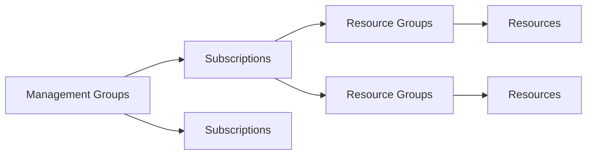

```mermaid
graph LR;
A[Management Groups]
B[Subscriptions]
C[Subscriptions]
D[Resource Groups]
E[Resource Groups]
F[Resources]
G[Resources]
    A-->B;
    A-->C;
    B-->D;
    B-->E;
    D-->F;
    E-->G;
```
